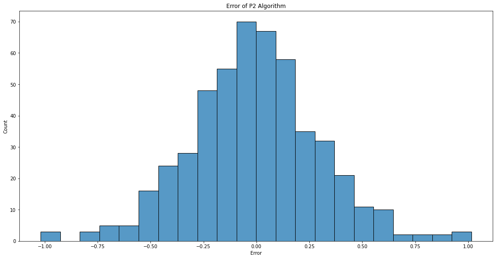

# P2 Algorithm for dynamic calculation of quantiles and histograms without storing observations
https://www.cs.wustl.edu/~jain/papers/ftp/psqr.pdf

## 500 Iterations of P2 Estimator with Data Size 250

```python
distribution = partial(np.random.normal, loc=0, scale=10, size=250)

true_medians, p2_medians, observations = main(iterations=500, distribution=distribution)

results = pd.DataFrame({"true_median": true_medians, "p2_median": p2_medians})
plt.figure(figsize=(18, 9))
sns.regplot(x="true_median", y="p2_median", data=results).set(title="P2 Algorithm vs. True Median", xlabel="True Median", ylabel="P2 Median")

error = results["true_median"] - results["p2_median"]
plt.figure(figsize=(18, 9))
sns.histplot(data=error).set(title="Error of P2 Algorithm", xlabel="Error", ylabel="Count")

plt.show()

```


    

    


    

    


# Sample of Iterations


```python
for i in range(5):
    plt.figure(figsize=(18, 9))
    ax = sns.histplot(observations[i])
    ax.set(title=f"Observations for iteration {i+1}", xlabel="Value", ylabel="Count")
    ax.axvline(results["true_median"][i], color="red", label="True Median")
    ax.axvline(results["p2_median"][i], color="green", label="P2 Median")

plt.show()
```


    

    


    

    


    

    


    

    


    

    

